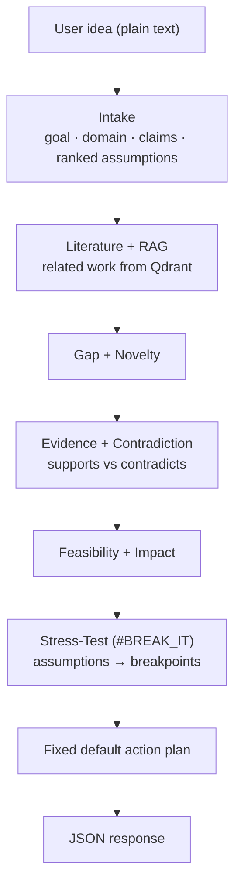
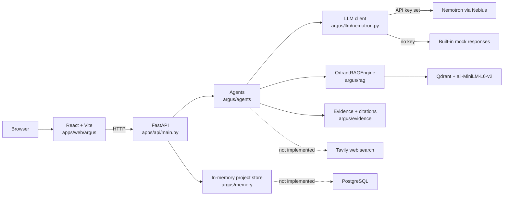

<div align="center">

# ARGUS

### AI Research & Decision Intelligence Agent

**Your idea. Under scrutiny.**


*Built for the Nebius × NVIDIA hackathon.*

</div>

---

ARGUS is an **adversarial reasoning agent**. Give it a research idea, a proposal or a decision. It is designed to pull out the assumptions underneath, look for evidence *for and against* them, stress-test them, and tell you where the idea is most likely to break, before you spend months building it.

> ## ⚠️ Read this before you trust any output
>
> **Without a real `NEMOTRON_API_KEY`, ARGUS does not analyse your idea.** The LLM client falls back to a built-in mock that returns canned output about *multimodal misinformation detection*, whatever you type. An unrelated idea (for example, a sorting algorithm for sparse graph databases) comes back with the same assumptions, the same breakpoints and the same feasibility and impact numbers.
>
> The mock also names papers (for example "Gupta et al. 2024"). **Those citations are placeholders. They have not been checked against real publications.** The same goes for the 12 entries in `ingest_evidence.py`.
>
> The real-LLM path (API key set) has **not been tested end to end**. Treat every result as a demo until it has.

---

## Why ARGUS

Most AI research tools help you *execute* an idea. They give you fluent summaries and encouraging answers. What they rarely answer is:

- What does this idea **assume**?
- What already **contradicts** it?
- Has it **already been done**?
- Under what condition does the claimed advantage **collapse**?
- What experiment would **prove it wrong**?

ARGUS inverts the usual question from *"How can AI help me build this?"* to:

> **"Try to break this before I build it."**

---

## What the Design Targets

This is what the pipeline is built to return. See [Status](#status) for what actually works today.

| Output | Description |
|---|---|
| **Idea breakdown** | Goal, domain, inputs, target, hypothesis, claims, and assumptions ranked by priority (1–5) |
| **Literature landscape** | Related work classified as baseline, extension, counterpoint or parallel |
| **Gap and novelty analysis** | Overlap score, differentiators, gap confidence |
| **Evidence groups** | Supporting, contradicting and neutral evidence retrieved from a vector store |
| **Feasibility and impact** | Dataset availability, compute, complexity, reproducibility, beneficiaries |
| **Breakpoints** | The condition at which the idea's claimed advantage falls apart, with severity |
| **Action plan** | Experiments aimed at the weakest assumptions |
| **Project memory** | Assumptions, breakpoints, experiments and open questions per project |

---

## Three Modes

| Mode | API route | UI route | Purpose |
|---|---|---|---|
| **INVESTIGATE** | `POST /investigate` | `/` | Full pipeline: idea → literature → gap → novelty → evidence → feasibility → impact → stress-test |
| **BREAK IT** | `POST /break-it` | `/break` | Extract assumptions, stress-test them, report breakpoints |
| **MIRROR** | `POST /mirror` | `/mirror` | Best / expected / failure scenarios for a decision. **Currently canned, see Known Issues** |

---

## The Pipeline



`/investigate` runs these phases directly in the request handler (`apps/api/main.py`). The `Orchestrator` class in `argus/orchestration/graph.py` is **not** used for the pipeline; the API calls it only to fetch a hardcoded list of five action-plan items.

### The signature feature: #BREAK_IT

1. **Rank** assumptions by how much of the idea depends on them
2. **Attack** each one with counter-evidence
3. **Stress-test** the claim as the assumption weakens
4. **Report the breakpoint**: the threshold where the advantage disappears
5. **Prescribe** the experiments that would confirm or kill it

Each assumption carries an evidence status (`strongly_supported`, `moderately_supported`, `weak_evidence`, `unknown`, `contradictory`) and each breakpoint a severity (`critical`, `high`, `moderate`, `low`).

---

## Architecture



Solid lines exist in code. Dashed lines are designed but not connected.

---

## Status

✅ works as described · 🟡 works, with caveats · 🚧 scaffold or stub · 📋 not started

| Component | File | Status | Notes |
|---|---|---|---|
| FastAPI app | `apps/api/main.py` | 🟡 | Serves `/`, `/health`, `/investigate`, `/break-it`, `/mirror`, `/dashboard`. Boots and returns 200 without any external service |
| LLM client | `argus/llm/nemotron.py` | 🟡 | Real HTTP call to the configured endpoint when a key is set (**untested**). With no key, returns **hardcoded misinformation-detection mocks** |
| Intake agent | `argus/agents/intake.py` | 🟡 | Calls the LLM for structured extraction. If the call fails, falls back to empty fields |
| Literature agent | `argus/agents/literature.py` | 🟡 | Searches the vector store only (single query, no query expansion, no Tavily). Returns 0 papers when Qdrant is empty or down |
| Gap agent | `argus/agents/gap.py` | 🟡 | LLM-driven, with a heuristic fallback |
| Contradiction agent | `argus/agents/contradiction.py` | 🟡 | LLM search plan plus RAG; falls back to mock contradictions |
| Novelty agent | `argus/agents/novelty.py` | 🟡 | Topic-overlap heuristic, no LLM. With no related work it returns a synthetic assessment |
| Feasibility agent | `argus/agents/feasibility.py` | 🟡 | LLM with heuristic fallback |
| Impact agent | `argus/agents/impact.py` | 🟡 | LLM with heuristic fallback |
| Stress-test agent | `argus/agents/stress_test.py` | 🟡 | LLM scenarios and breakpoints, mock fallback. Not driven by retrieved counter-evidence yet |
| Orchestrator | `argus/orchestration/graph.py` | 🚧 | `InvestigationState` model is solid; every phase method is a `TODO` stub |
| RAG engine | `argus/rag/qdrant_engine.py` | 🟡 | Qdrant search, claim retrieval and storage. Needs a running Qdrant. Default embedding model is `all-MiniLM-L6-v2` |
| Evidence and citations | `argus/evidence/sources.py` | ✅ | `Source`, `EvidenceRecord`, `Citation`, `EvidenceManager` |
| Project memory | `argus/memory/postgres_memory.py` | 🟡 | **In-memory only**, lost on restart. A database URL env var is read but no connection is made. Not written to by any route |
| Evidence seeding | `ingest_evidence.py` | 🟡 | Loads 12 hardcoded sample items about multimodal misinformation into Qdrant. **Sample data, not a real corpus** |
| Web UI | `apps/web/argus` | 🚧 | Pages exist; likely fails to load (see Known Issues). Mirror and Dashboard pages use hardcoded data |
| Tavily web research | n/a | 📋 | Package is in `requirements.txt`; no code calls it |
| PDF ingestion | n/a | 📋 | `pymupdf` and `unstructured` are in `requirements.txt`; no code uses them |
| Terminal demo | `hackathon_demo.py` | ✅ | Scripted walkthrough, no backend needed |
| Tests | `tests/test_agents.py`, `test_smoke.py` | 🟡 | 17 tests: 12 pass, 5 fail (see Known Issues) |

**What "runs" means today:** with no key and no Qdrant, `/investigate` returns HTTP 200 with a fully populated response. That response is mock content plus empty evidence (0 supporting, 0 contradicting, 0 papers). It is not an analysis of your input.

---

## Quick Start

### Watch the demo (no setup)

```bash
python hackathon_demo.py
```

A scripted terminal run-through of INVESTIGATE → BREAK IT. The numbers shown are **illustrative**, not output from the real pipeline.

### Run the backend

```bash
pip install -r requirements.txt
uvicorn apps.api.main:app --reload --port 8000
```

Run from the repository root. Interactive docs are at `http://localhost:8000/docs`.

`requirements.txt` pins versions but includes heavy packages (`sentence-transformers`, `unstructured`, `pymupdf`). `unstructured`, `pymupdf`, `tavily-python` and `openai` are not used by any current code. For the API as it stands, the minimum is `fastapi`, `uvicorn`, `pydantic`, `requests`, `qdrant-client` and `sqlalchemy`; add `sentence-transformers` for embeddings.

On startup you will see `Qdrant collection init: [Errno 111] Connection refused` if Qdrant is not running. The API still starts.

### Start Qdrant and seed sample evidence (optional)

```bash
docker run -p 6333:6333 qdrant/qdrant
python ingest_evidence.py
```

This loads the 12 sample items. They only match ideas about multimodal misinformation detection.

### Connect a real LLM (optional, untested path)

```bash
export NEMOTRON_API_KEY=your-nebius-key
# optionally:
export NEMOTRON_ENDPOINT=https://.../v1/chat/completions
export NEMOTRON_MODEL=your-model-id
```

Check the endpoint and model ID against your Nebius account. The defaults in `argus/llm/nemotron.py` have not been verified against a live service.

### Run the tests

```bash
pytest
```

Run from the repository root; this picks up both `tests/test_agents.py` and `test_smoke.py`.

### Run the frontend

```bash
cd apps/web/argus
npm install
npm run dev
```

Vite serves the app under `/argus/` (e.g. `http://localhost:5173/argus/`). Pages call the API with relative URLs (`/investigate`, `/break-it`) and **no dev proxy is configured**, so those requests hit the Vite server, not port 8000. Add a proxy to `vite.config.js` or change the fetch URLs. The API's CORS allows only `http://localhost:5173` and `http://127.0.0.1:5173`. The app also has load-time bugs; see Known Issues.

---

## API Reference

Default base URL: `http://localhost:8000`.

| Method | Endpoint | Description |
|---|---|---|
| `GET` | `/` | Service banner and version |
| `GET` | `/health` | Liveness check with timestamp |
| `POST` | `/investigate` | Run the full pipeline on an idea |
| `POST` | `/break-it` | Extract assumptions, retrieve evidence, stress-test, return breakpoints |
| `POST` | `/mirror` | Three scenarios. **Fixed template text**, not analysis of your idea |
| `GET` | `/dashboard` | Returns `50.0` for every metric plus `total_projects`. **Placeholder values** |

**Example**

```bash
curl -X POST http://localhost:8000/investigate \
  -H "Content-Type: application/json" \
  -d '{"idea": "An efficient multimodal model for misinformation detection"}'
```

Request body (`InvestigateRequest`):

| Field | Type | Default | Description |
|---|---|---|---|
| `idea` | string | required | The idea, claim or proposal |
| `mode` | string | `"investigate"` | Echoed back in the response |
| `use_tavily` | bool | `true` | **Ignored.** Web research is not implemented |
| `create_project` | bool | `true` | **Ignored.** No route writes to project memory |

Responses use the envelope `{investigation_id, mode, status, message, data}`.

`/investigate` returns `data.extracted_ideas`, `research_landscape`, `novelty`, `evidence`, `contradictions`, `feasibility`, `impact`, `stress_test`, `action_plan`, `overall_assessment` and `processing_time_seconds`. Scores are on a 0–100 scale in `data`. The `investigation_id` is an MD5 prefix of the idea text, so the same idea always gets the same ID.

---

## Configuration

| Variable | Used by | Description |
|---|---|---|
| `NEMOTRON_API_KEY` | `argus/llm/nemotron.py` | Nebius API key. If unset or `demo-key`, **mock mode is used** |
| `NEMOTRON_ENDPOINT` | `argus/llm/nemotron.py` | Chat-completions URL. Default `https://api.nebius.com/v1/chat/completions` (unverified) |
| `NEMOTRON_MODEL` | `argus/llm/nemotron.py` | Model ID. Default `nvidia/nemotron-3-ultra` (unverified) |
| `QDRANT_URL`, `QDRANT_API_KEY`, `QDRANT_COLLECTION` | `ingest_evidence.py` only | **The API does not read these.** It builds `QdrantRAGEngine()` with the default `localhost:6333` |
| `NEBIUS_DB_URL` / `POSTGRES_URL` / `DATABASE_URL` | memory backend | Read at startup; storage is still in-memory |

---

## Project Structure

```
ARGUS/
├── apps/
│   ├── api/main.py                 # FastAPI app and pipeline handlers
│   └── web/argus/                  # React + Vite + Tailwind frontend
│       └── src/
│           ├── App.jsx             # Shell, routing, mode switching
│           ├── pages/              # home · investigation · break · mirror · dashboard
│           └── components/         # common/ModeToggle · dashboard/DashboardSummary
├── argus/                          # Core Python package
│   ├── agents/                     # intake · literature · gap · novelty · contradiction
│   │                               # feasibility · impact · stress_test
│   ├── llm/nemotron.py             # LLM client + mock fallback
│   ├── orchestration/graph.py      # InvestigationState + stub Orchestrator
│   ├── rag/                        # engine.py (evidence models) · qdrant_engine.py
│   ├── evidence/sources.py         # Source, EvidenceRecord, Citation, EvidenceManager
│   └── memory/                     # postgres_memory.py · memory_agent.py
├── tests/test_agents.py            # pytest suite
├── test_smoke.py                   # API smoke tests (httpx)
├── ingest_evidence.py              # Seeds Qdrant with 12 sample items
├── hackathon_demo.py               # Scripted terminal demo
└── requirements.txt
```

---

## Known Issues

Items 1 to 8 were verified by running the code or tests. Items 9 and 10 come from reading the code; the frontend was not built or run.

1. **Mock mode ignores your input.** Without an API key the LLM client returns the same misinformation-themed output for every idea, including fake paper citations. Nothing in the API response tells you the output is mocked.
2. **Five failing tests** (12 of 17 pass). `test_all_agents_importable` builds `ContradictionAgent()` without its required arguments. The novelty, feasibility and impact tests construct models without their now-required fields. `test_memory_backend_basic` expects an integer open-question id but gets the string `"0"`.
3. **Novelty can return 0.** For an unrelated idea in mock mode the novelty score came back `0.0`, while the same code returned `30.0` for the misinformation idea. The scoring heuristic has no defined meaning yet.
4. **Mirror is canned.** `/mirror` returns the same three scenarios with fixed outcomes ("+10-12%", "+5-7%") for any idea. Only the first extracted assumption text changes. The Mirror page also generates sample scenarios locally.
5. **`/dashboard` returns constants.** Every metric is `50.0`. The per-metric scores computed inside `/investigate` are never returned or stored.
6. **Request flags are ignored.** `use_tavily` and `create_project` have no effect, and no route reads or writes project memory.
7. **Evidence is empty by default.** The API builds `QdrantRAGEngine()` at import time with hardcoded defaults. With no Qdrant, or with an empty collection, every evidence and literature count is 0. The class docstring mentions BGE embeddings, but the default model is `all-MiniLM-L6-v2`.
8. **Memory is volatile.** All projects are lost on restart, and project IDs come from Python's per-process `hash()`.
9. **Frontend probably crashes on load.** `App.jsx` calls `useNavigate()` in the `App` component while `<Router>` is rendered inside it, and `main.jsx` uses `React.StrictMode` without importing `React`. The Dashboard page uses mock data (`generateMockDashboard`).
10. **No frontend-to-API wiring.** Relative fetch URLs plus no Vite proxy means calls do not reach port 8000 in development.

Fixed since the last README: the CORS wildcard with credentials (now two localhost origins, no credentials), the `argus/__init__.py` broken exports, the novelty ×100 scaling in `/investigate`, the duplicate agent construction inside the handler, and the invalid `bge-m3` / `qdrant-fastapi` entries in `requirements.txt`.

---

## Roadmap

| Priority | Item |
|---|---|
| 1 | Make mock mode visible: add a `mock: true` flag to every response and log a warning, so nobody mistakes demo output for analysis |
| 2 | Fix the frontend router and React import bugs, add a Vite proxy, and add a test that boots the UI |
| 3 | Fix the five failing tests and keep `pytest` green |
| 4 | Run the pipeline against a real Nemotron endpoint and record where structured-JSON parsing fails |
| 5 | Replace the sample corpus with real, verifiable sources. Every cited paper needs a retrievable link |
| 6 | Add Tavily search to the literature agent and honour `use_tavily` |
| 7 | Drive the stress-test from retrieved counter-evidence instead of LLM-generated severity |
| 8 | Wire `Orchestrator` to the real agents and use it from the API; make `/mirror` analyse the actual idea |
| 9 | Persist memory in PostgreSQL, honour `create_project`, and expose project routes |
| 10 | Define a scoring method for each dashboard metric, and serve real values from `/dashboard` |
| 11 | PDF upload and ingestion, plus report export with citations |
| 12 | Evaluation set of ideas with known outcomes, the honest way to measure whether BREAK finds real failures |

**A design note for the gap and contradiction agents:** absence of evidence in Qdrant or on the web is not evidence of absence. Every gap claim should carry its search limitations and a confidence value, and every statement should link to a retrievable source.

---

## Tech Stack

- **Backend:** FastAPI, Pydantic, Uvicorn
- **Frontend:** React 19, Vite, Tailwind CSS 4, react-router-dom 7
- **Reasoning:** NVIDIA Nemotron via Nebius AI Cloud (OpenAI-style chat endpoint), with a mock fallback
- **Retrieval:** Qdrant, `all-MiniLM-L6-v2` via sentence-transformers
- **Planned:** Tavily web research, PostgreSQL via SQLAlchemy, PDF ingestion with PyMuPDF

---

<div align="center">

**ARGUS: making your ideas stronger before you build them.**

</div>
