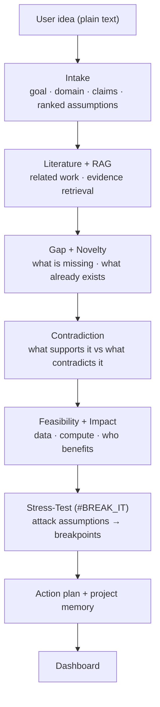
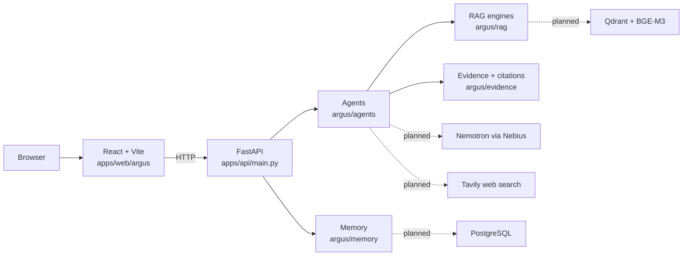

<div align="center">

# ARGUS

### AI Research & Decision Intelligence Agent

**Your idea. Under scrutiny.**


*Built for the Nebius × NVIDIA hackathon.*

</div>

---

ARGUS is an **adversarial reasoning agent**. Give it a research idea, a proposal or a decision. It pulls out the assumptions underneath, looks for evidence *for and against* them, stress-tests them, and tells you where the idea is most likely to break, before you spend months building it.


---

## Why ARGUS

Most AI research tools help you *execute* an idea. They give you fluent summaries and encouraging answers. What they rarely answer is:

- What does this idea **assume**?
- What already **contradicts** it?
- Has it **already been done**?
- Under what condition does the claimed advantage **collapse**?
- What experiment would **prove it wrong**?

The cost of not asking shows up late: a result that doesn't replicate, a "novel" idea published two years ago, a model that only works when a hidden condition holds. ARGUS inverts the usual question from *"How can AI help me build this?"* to:

> **"Try to break this before I build it."**

---

## What You Get Back

| Output | Description |
|---|---|
| **Idea breakdown** | Goal, domain, inputs, target, hypothesis, claims, and assumptions ranked by priority (1–5) |
| **Literature landscape** | Related work classified as baseline, extension, counterpoint or parallel |
| **Gap and novelty analysis** | Overlap percentage, differentiators, gap confidence and stated search limitations |
| **Evidence groups** | Supporting, contradicting and neutral evidence with source, page and confidence |
| **Feasibility and impact** | Dataset availability, compute, complexity, reproducibility, beneficiaries |
| **Breakpoints** | The condition at which the idea's claimed advantage falls apart, with severity |
| **Action plan** | Concrete experiments aimed at the weakest assumptions |
| **Project memory** | Assumptions, breakpoints, experiments, decisions and open questions saved per project |

---

## Three Modes

| Mode | Route | Purpose |
|---|---|---|
| **INVESTIGATE** | `/` | Full pipeline: idea → literature → gap → novelty → evidence → feasibility → impact |
| **BREAK IT** | `/break` | Signature feature. Attack the top assumptions and report the breakpoint |
| **MIRROR** | `/mirror` | Counterfactual scenarios (best / expected / failure case) for a decision |

---

## The Pipeline



### The signature feature: #BREAK_IT

Investigation tells you what exists. BREAK tells you where your idea stops working.

1. **Rank** assumptions by how much of the idea depends on them
2. **Attack** each one with targeted counter-evidence
3. **Stress-test** the claim as the assumption weakens
4. **Report the breakpoint**: the threshold where the advantage disappears
5. **Prescribe** the experiments that would confirm or kill it

Each assumption carries an evidence status (`strongly_supported`, `moderately_supported`, `weak_evidence`, `unknown`, `contradictory`) and each breakpoint a severity (`critical`, `high`, `moderate`, `low`).

---

## Architecture



Solid lines exist in code today. Dashed lines are integrations that are designed but not connected. The API does not currently use the memory backend, so project memory is reachable only from Python.

---

## Status

✅ implemented · 🟡 heuristic / placeholder logic · 🚧 scaffold only (models and stubs) · 📋 planned

| Component | File | Status | Notes |
|---|---|---|---|
| FastAPI app | `apps/api/main.py` | 🟡 | Starts and serves `/`, `/health`, `/investigate`, `/break-it`, `/mirror`. Results are mostly empty because the agents behind it are stubs |
| Intake agent | `argus/agents/intake.py` | 🚧 | Models done, `extract()` returns empty fields |
| Literature agent | `argus/agents/literature.py` | 🚧 | Models done, `search()` returns `[]` |
| Gap agent | `argus/agents/gap.py` | 🚧 | Models done, analysis is a TODO |
| Contradiction agent | `argus/agents/contradiction.py` | 🚧 | Models done, `search_contradictions()` returns `[]` |
| Novelty agent | `argus/agents/novelty.py` | 🟡 | Topic-overlap heuristic, no LLM. Scores are 0–100 |
| Feasibility agent | `argus/agents/feasibility.py` | 🟡 | Keyword-based scoring, no LLM |
| Impact agent | `argus/agents/impact.py` | 🟡 | Heuristic scoring |
| Stress-test agent | `argus/agents/stress_test.py` | 🟡 | Scenario and breakpoint models; with no assumptions in, it reports "idea appears robust" |
| Orchestrator / state graph | `argus/orchestration/graph.py` | 🚧 | `InvestigationState` model is solid; phases are stubs. The API only calls `_generate_default_action_plan()` |
| RAG engine | `argus/rag/engine.py` | 🚧 | Typed evidence models; returns nothing unless a vector DB is passed in, and the API passes none |
| Qdrant RAG engine | `argus/rag/qdrant_engine.py` | 🟡 | Qdrant client and BGE-M3 embedding code; not used by the API |
| Evidence and citations | `argus/evidence/sources.py` | ✅ | `Source`, `EvidenceRecord`, `Citation`, `EvidenceManager` |
| Project memory | `argus/memory/postgres_memory.py` | 🟡 | **In-memory only**, lost on restart. A database URL env var is read but no connection is made. Not exposed through the API |
| Web UI | `apps/web/argus` | 🟡 | Home, Investigation, Break, Mirror and Dashboard pages. Mirror and Dashboard use hardcoded mock data |
| Nemotron integration | `apps/api/main.py` | 🚧 | Endpoint and key env vars are read, but no code calls the model |
| Terminal demo | `hackathon_demo.py` | ✅ | Scripted 3-minute walkthrough, no backend needed |
| Tests | `tests/test_agents.py` | 🟡 | 11 tests; 6 pass, 5 fail (see Known Issues) |

**Today the pipeline runs end to end but produces little real analysis.** With no intake, retrieval or LLM, `/investigate` returns empty extraction, zero evidence and no breakpoints. The dashboard metrics come from heuristics or fallback values, so do not present them as findings yet.

---

## Quick Start

### Watch the demo (no setup)

```bash
python hackathon_demo.py
```

A scripted 3-minute terminal run-through of the INVESTIGATE → BREAK IT flow. The numbers shown (38 sources, Novelty 78%, etc.) are **illustrative**, not output from the real pipeline.

### Run the backend

```bash
pip install -r requirements.txt
uvicorn apps.api.main:app --reload --port 8000
```

Run from the repository root, not from `apps/api`. Interactive docs are at `http://localhost:8000/docs`.

`requirements.txt` includes heavy packages (`sentence-transformers`, `unstructured`, `pymupdf`). For the current API you only need `fastapi`, `uvicorn`, `pydantic` and `requests`.

### Run the tests

```bash
pip install pytest httpx
pytest tests
```

### Run the frontend

```bash
cd apps/web/argus
npm install
npm run dev
```

Vite serves the app under the `/argus/` base path (e.g. `http://localhost:5173/argus/`). The pages call the API with relative URLs (`/investigate`, `/break-it`), and no dev proxy is configured, so add one to `vite.config.js` pointing at `http://localhost:8000` or change the fetch URLs. The app also crashes on load until the router bug in Known Issues is fixed.

---

## API Reference

All routes are on the FastAPI app (default `http://localhost:8000`).

| Method | Endpoint | Description |
|---|---|---|
| `GET` | `/` | Service banner and version |
| `GET` | `/health` | Liveness check with timestamp |
| `POST` | `/investigate` | Run the full pipeline on an idea |
| `POST` | `/break-it` | Adversarial mode: extract assumptions, stress-test, return breakpoints |
| `POST` | `/mirror` | Best / expected / failure scenarios. **Currently returns fixed template text**, not analysis of your idea |

The memory routes (`/memory/*`) and `/dashboard` that earlier versions described no longer exist. Dashboard values are returned inside the `/investigate` response under `data`.

**Example**

```bash
curl -X POST http://localhost:8000/investigate \
  -H "Content-Type: application/json" \
  -d '{"idea": "An efficient multimodal model for misinformation detection"}'
```

Request body (`InvestigateRequest`):

| Field | Type | Default | Description |
|---|---|---|---|
| `idea` | string | required | The idea, claim or proposal |
| `mode` | string | `"investigate"` | `investigate`, `break` or `mirror` |
| `use_tavily` | bool | `true` | Accepted but ignored; web research is not implemented |
| `create_project` | bool | `true` | Accepted but ignored; the API does not write to memory |

Responses use the envelope `{investigation_id, mode, status, message, data}`.

---

## Configuration

| Variable | Used by | Description |
|---|---|---|
| `NEMOTRON_ENDPOINT` | `main.py` | Chat-completions URL. Defaults to `https://api.nebius.com/v1/chat/completions`. Read but not yet used |
| `NEMOTRON_API_KEY` | `main.py` | Nebius API key. Defaults to a placeholder `demo-key`. Read but not yet used |
| `NEBIUS_DB_URL` / `POSTGRES_URL` / `DATABASE_URL` | memory backend | Read at startup; storage is still in-memory |

Qdrant settings (`qdrant_url`, `qdrant_api_key`, embedding model `BAAI/bge-m3`, collection `argus_evidence`) are constructor arguments on `QdrantRAGEngine` rather than environment variables. A `TAVILY_API_KEY` will be needed once web research is added.

---

## Project Structure

```
ARGUS/
├── apps/
│   ├── api/
│   │   └── main.py                 # FastAPI app: health, investigate, break-it, mirror
│   └── web/argus/                  # React + Vite + Tailwind frontend
│       └── src/
│           ├── App.jsx             # Shell, routing, mode switching
│           ├── pages/              # home · investigation · break · mirror · dashboard
│           └── components/         # DashboardSummary, ModeToggle
├── argus/                          # Core Python package
│   ├── agents/                     # intake · literature · gap · novelty · contradiction
│   │                               # feasibility · impact · stress_test
│   ├── orchestration/graph.py      # InvestigationState + Orchestrator
│   ├── rag/                        # engine.py (evidence models) · qdrant_engine.py
│   ├── evidence/sources.py         # Source, EvidenceRecord, Citation, EvidenceManager
│   └── memory/                     # postgres_memory.py · memory_agent.py
├── tests/test_agents.py            # pytest suite
├── hackathon_demo.py               # Scripted terminal demo
└── requirements.txt
```

---

## Known Issues

Verified by running the code and tests.

1. **Frontend crashes on load.** `App.jsx` calls `useNavigate()` in the `App` component, but `<Router>` is rendered inside it. The hook must be called below the router, e.g. by wrapping `<App />` in `<BrowserRouter>` in `main.jsx`.
2. **Novelty score scale bug.** `NoveltyAgent` already returns 0–100, but `/investigate` multiplies it by 100 again in `data.novelty.score` (a 30 becomes 3000) and by 10 in the dashboard value. Other metrics mix 0–1, 0–10 and 0–100 the same way.
3. **Five failing tests.** `test_all_agents_importable` builds `ContradictionAgent()` without its required arguments. The novelty, feasibility and impact tests construct models without their now-required fields. `test_memory_backend_basic` expects an integer open-question id but gets the string `"0"`.
4. **Mirror is canned.** `/mirror` returns the same three scenarios and "+10-12%" style outcomes for any idea. The Mirror page and the Dashboard page also use hardcoded mock data.
5. **Request flags are ignored.** `use_tavily` and `create_project` have no effect, and no route reads or writes project memory.
6. **Duplicate agent construction.** `/investigate` re-creates several agents inside the handler, shadowing the module-level ones.
7. **`argus/__init__.py` exports names that do not exist** (`QdrantRAGEngine`, `PostgresMemoryBackend` are not imported), so `from argus import *` fails.
8. **`requirements.txt`** lists `bge-m3` and `qdrant-fastapi`, which are not valid pip packages for this use. Load BGE-M3 through `sentence-transformers`. No versions are pinned, and `requests`, `pytest` and `httpx` are not listed.
9. **CORS is `allow_origins=["*"]` with `allow_credentials=True`.** Restrict origins before any deployment.
10. **Memory is volatile.** All projects are lost on restart, and project IDs are derived from Python's per-process `hash()`.

---

## Roadmap

| Priority | Item |
|---|---|
| 1 | Fix the frontend router crash, the score scales and the failing tests; keep a smoke test that boots the app |
| 2 | Implement `IntakeAgent.extract()` with Nemotron (structured JSON output) |
| 3 | Connect `RAGEngine` to `QdrantRAGEngine` and add Tavily search to the literature agent |
| 4 | Implement contradiction search (Query A "what supports this?" vs Query B "what contradicts this?") |
| 5 | Drive the stress-test from retrieved counter-evidence instead of fixed severity |
| 6 | Wire `Orchestrator` to the real agents and use it from the API; make `/mirror` analyse the actual idea |
| 7 | Persist memory in PostgreSQL and expose it through the API again |
| 8 | Define a scoring method for each dashboard metric |
| 9 | PDF upload and ingestion, plus report export with citations and an agent trace |
| 10 | Evaluation set of ideas with known outcomes, the honest way to measure whether BREAK finds real failures |

**A design note for the gap and contradiction agents:** absence of evidence in Qdrant and Tavily is not evidence of absence. Every gap claim should carry its search limitations and a confidence value, and every statement should link to a retrievable source.

---

## Tech Stack

- **Backend:** FastAPI, Pydantic, Uvicorn
- **Frontend:** React 19, Vite, Tailwind CSS 4, react-router-dom 7
- **Reasoning:** NVIDIA Nemotron via Nebius AI Cloud (OpenAI-style chat endpoint)
- **Retrieval:** Qdrant, BGE-M3 via sentence-transformers
- **Web research:** Tavily
- **Storage:** PostgreSQL via SQLAlchemy (planned), in-memory today
- **Documents:** PyMuPDF, `unstructured` (planned)

---

<div align="center">

**ARGUS: making your ideas stronger before you build them.**

</div>
# ARGUS-Your-idea.-Under-scrutiny.
# ARGUS-Your-idea.-Under-scrutiny.
