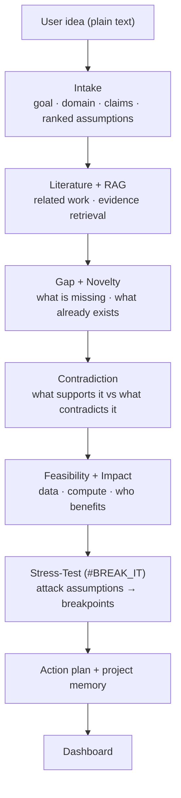
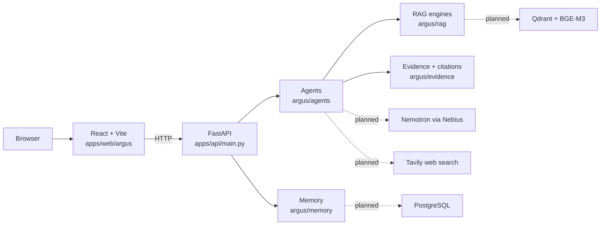

<div align="center">

# ARGUS

### AI Research & Decision Intelligence Agent

**Your idea. Under scrutiny.**


*Built for the Nebius × NVIDIA hackathon.*

</div>

---

ARGUS is an **adversarial reasoning agent**. Give it a research idea, a proposal or a decision. It pulls out the assumptions underneath, looks for evidence *for and against* them, stress-tests them, and tells you where the idea is most likely to break, before you spend months building it.


---

## Why ARGUS

Most AI research tools help you *execute* an idea. They give you fluent summaries and encouraging answers. What they rarely answer is:

- What does this idea **assume**?
- What already **contradicts** it?
- Has it **already been done**?
- Under what condition does the claimed advantage **collapse**?
- What experiment would **prove it wrong**?

The cost of not asking shows up late: a result that doesn't replicate, a "novel" idea published two years ago, a model that only works when a hidden condition holds. ARGUS inverts the usual question from *"How can AI help me build this?"* to:

> **"Try to break this before I build it."**

---

## What You Get Back

| Output | Description |
|---|---|
| **Idea breakdown** | Goal, domain, inputs, target, hypothesis, claims, and assumptions ranked by priority (1–5) |
| **Literature landscape** | Related work classified as baseline, extension, counterpoint or parallel |
| **Gap and novelty analysis** | Overlap percentage, differentiators, gap confidence and stated search limitations |
| **Evidence groups** | Supporting, contradicting and neutral evidence with source, page and confidence |
| **Feasibility and impact** | Dataset availability, compute, complexity, reproducibility, beneficiaries |
| **Breakpoints** | The condition at which the idea's claimed advantage falls apart, with severity |
| **Action plan** | Concrete experiments aimed at the weakest assumptions |
| **Project memory** | Assumptions, breakpoints, experiments, decisions and open questions saved per project |

---

## Three Modes

| Mode | Route | Purpose |
|---|---|---|
| **INVESTIGATE** | `/` | Full pipeline: idea → literature → gap → novelty → evidence → feasibility → impact |
| **BREAK IT** | `/break` | Signature feature. Attack the top assumptions and report the breakpoint |
| **MIRROR** | `/mirror` | Counterfactual scenarios (best / expected / failure case) for a decision |

---

## The Pipeline



### The signature feature: #BREAK_IT

Investigation tells you what exists. BREAK tells you where your idea stops working.

1. **Rank** assumptions by how much of the idea depends on them
2. **Attack** each one with targeted counter-evidence
3. **Stress-test** the claim as the assumption weakens
4. **Report the breakpoint**: the threshold where the advantage disappears
5. **Prescribe** the experiments that would confirm or kill it

Each assumption carries an evidence status (`strongly_supported`, `moderately_supported`, `weak_evidence`, `unknown`, `contradictory`) and each breakpoint a severity (`critical`, `high`, `moderate`, `low`).

---

## Architecture



Solid lines exist in code today. Dashed lines are the integrations that are designed but not connected.

---

## Status

✅ implemented · 🟡 heuristic / placeholder logic · 🚧 scaffold only (models and stubs) · 📋 planned

| Component | File | Status | Notes |
|---|---|---|---|
| FastAPI app, routes, request/response models | `apps/api/main.py` | 🟡 | Routes defined; currently fails on startup (see Known Issues) |
| Intake agent | `argus/agents/intake.py` | 🚧 | Models done, `extract()` returns empty fields |
| Literature agent | `argus/agents/literature.py` | 🚧 | Models done, `search()` returns `[]` |
| Gap agent | `argus/agents/gap.py` | 🚧 | Models done, analysis is a TODO |
| Contradiction agent | `argus/agents/contradiction.py` | 🚧 | Models done, search is a TODO |
| Novelty agent | `argus/agents/novelty.py` | 🟡 | Topic-overlap heuristic, no LLM |
| Feasibility agent | `argus/agents/feasibility.py` | 🟡 | Keyword-based scoring, no LLM |
| Impact agent | `argus/agents/impact.py` | 🟡 | Heuristic scoring |
| Stress-test agent | `argus/agents/stress_test.py` | 🟡 | Scenario and breakpoint models; fixed severity and confidence |
| Orchestrator / state graph | `argus/orchestration/graph.py` | 🚧 | `InvestigationState` model is solid; every phase is a TODO stub |
| RAG engine (retrieve, group evidence) | `argus/rag/engine.py` | 🚧 | Typed evidence models; retrieval is a TODO |
| Qdrant RAG engine | `argus/rag/qdrant_engine.py` | 🟡 | Qdrant client and BGE-M3 embedding code; not used by the API yet |
| Evidence and citations | `argus/evidence/sources.py` | ✅ | `Source`, `EvidenceRecord`, `Citation`, `EvidenceManager` |
| Project memory | `argus/memory/postgres_memory.py` | 🟡 | **In-memory only.** Data is lost on restart; `DATABASE_URL` is read but no DB connection is made |
| Web UI | `apps/web/argus` | 🟡 | Home, Investigation, Break, Mirror and Dashboard pages |
| Nemotron call helper | `call_nemotron()` in `main.py` | 🟡 | Written, but no agent calls it |
| Terminal demo | `hackathon_demo.py` | ✅ | Scripted 3-minute walkthrough, no backend needed |

**Dashboard scores are not yet meaningful.** The six dashboard metrics (novelty, evidence, feasibility, impact, gap, breakpoint) come from the heuristics above or from hardcoded fallback values. Define how each is computed before presenting them as findings.

---

## Quick Start

### Watch the demo (no setup)

```bash
python hackathon_demo.py
```

A scripted 3-minute terminal run-through of the INVESTIGATE → BREAK IT flow. The numbers shown (38 sources, Novelty 78%, etc.) are **illustrative**, not output from the real pipeline.

### Run the backend

```bash
pip install -r requirements.txt
uvicorn apps.api.main:app --reload --port 8000
```

Run from the repository root, not from `apps/api`. Interactive docs are at `http://localhost:8000/docs`.

> The backend will not start until the issues in [Known Issues](#known-issues) are fixed. Items 1–3 there are one-line fixes.

### Run the frontend

```bash
cd apps/web/argus
npm install
npm install react-router-dom   # imported by the app but missing from package.json
npm run dev
```

The Vite config serves the app under the `/argus/` base path. The pages call the API with relative URLs (`/investigate`, `/break-it`), and no dev proxy is configured, so add one to `vite.config.js` pointing at `http://localhost:8000` or change the fetch URLs.

---

## API Reference

All routes are on the FastAPI app (default `http://localhost:8000`).

| Method | Endpoint | Description |
|---|---|---|
| `GET` | `/` | Service banner, version, active memory backend |
| `GET` | `/health` | Liveness and component status |
| `POST` | `/investigate` | Run the full pipeline on an idea |
| `POST` | `/break-it` | Adversarial mode: investigation plus breakpoint detection |
| `POST` | `/mirror` | Counterfactual scenarios per assumption |
| `GET` | `/dashboard` | Six dashboard metrics |
| `POST` | `/memory/create-project` | Create a project |
| `GET` | `/memory/projects` | List projects |
| `GET` | `/memory/project/{project_id}` | Fetch one project |
| `POST` | `/memory/add-assumption` | Add an assumption |
| `POST` | `/memory/add-breakpoint` | Add a breakpoint |
| `POST` | `/memory/add-experiment` | Record an experiment |
| `POST` | `/memory/add-open-question` | Record an open question |

**Example**

```bash
curl -X POST http://localhost:8000/investigate \
  -H "Content-Type: application/json" \
  -d '{"idea": "An efficient multimodal model for misinformation detection", "mode": "investigate", "use_tavily": false}'
```

Request body (`InvestigateRequest`):

| Field | Type | Default | Description |
|---|---|---|---|
| `idea` | string | required | The idea, claim or proposal |
| `mode` | string | `"investigate"` | `investigate`, `break` or `mirror` |
| `use_tavily` | bool | `true` | Use live web research (not yet implemented) |
| `create_project` | bool | `true` | Save the run to project memory |

---

## Configuration

| Variable | Used by | Description |
|---|---|---|
| `NEMOTRON_ENDPOINT` | `main.py` | Chat-completions URL. Defaults to `https://api.nebius.com/v1/chat/completions` |
| `NEMOTRON_API_KEY` | `main.py` | Nebius API key. Defaults to a placeholder `demo-key` |
| `NEBIUS_DB_URL` / `POSTGRES_URL` / `DATABASE_URL` | memory backend | Read at startup; storage is still in-memory |

Qdrant settings (`qdrant_url`, `qdrant_api_key`, embedding model `BAAI/bge-m3`, collection `argus_evidence`) are constructor arguments on `QdrantRAGEngine` rather than environment variables. A `TAVILY_API_KEY` will be needed once web research is added.

---

## Project Structure

```
ARGUS/
├── apps/
│   ├── api/
│   │   └── main.py                 # FastAPI app: investigate, break-it, mirror, memory, dashboard
│   └── web/argus/                  # React + Vite + Tailwind frontend
│       └── src/
│           ├── App.jsx             # Shell, routing, mode switching
│           ├── pages/              # home · investigation · break · mirror · dashboard
│           └── components/         # DashboardSummary, ModeToggle
├── argus/                          # Core Python package
│   ├── agents/                     # intake · literature · gap · novelty · contradiction
│   │                               # feasibility · impact · stress_test
│   ├── orchestration/graph.py      # InvestigationState + Orchestrator
│   ├── rag/                        # engine.py (evidence models) · qdrant_engine.py
│   ├── evidence/sources.py         # Source, EvidenceRecord, Citation, EvidenceManager
│   └── memory/                     # postgres_memory.py · memory_agent.py
├── hackathon_demo.py               # Scripted terminal demo
└── requirements.txt
```

---

## Known Issues

Verified by importing the code. Fix these first.

1. **API does not start.** `ContradictionAgent()` in `main.py` is constructed with no arguments, but its `__init__` requires `evidence_store` and `rag_engine`.
2. **Missing names in `main.py`.** `Orchestrator` is used but never imported, and `stress_agent` is used but never created (`StressTestAgent` is imported, not instantiated).
3. **Typo in `/break-it`.** It calls `investiate(...)` instead of `investigate(...)`.
4. **`/dashboard` awaits a synchronous function.** `await memory_backend.get_all_projects()` will raise, because the method is not async. It also falls back to hardcoded scores.
5. **`argus/__init__.py` exports names that do not exist** (`QdrantRAGEngine`, `PostgresMemoryBackend`), so `from argus import *` fails.
6. **Score scales are inconsistent.** Some agents return 0–1, some 0–100, and the dashboard model documents 0–10, but `main.py` mixes multipliers.
7. **`requirements.txt`** lists `bge-m3` and `qdrant-fastapi`, which are not valid pip packages for this use. Load BGE-M3 through `sentence-transformers`. No versions are pinned, and `requests` is used but not listed.
8. **Frontend dependency gap.** `react-router-dom` is imported but not in `package.json`, and `App.jsx` calls `useNavigate()` outside its `<Router>`.
9. **CORS is `allow_origins=["*"]` with `allow_credentials=True`.** Restrict origins before any deployment.
10. **Memory is volatile.** All projects are lost on restart, and project IDs use Python's per-process `hash()`.
11. **No tests.**

---

## Roadmap

| Priority | Item |
|---|---|
| 1 | Fix the startup bugs above and add a smoke test that boots the app |
| 2 | Implement `IntakeAgent.extract()` with Nemotron (structured JSON output) |
| 3 | Connect `RAGEngine` to `QdrantRAGEngine` and add Tavily search to the literature agent |
| 4 | Implement contradiction search (Query A "what supports this?" vs Query B "what contradicts this?") |
| 5 | Drive the stress-test from retrieved counter-evidence instead of fixed severity |
| 6 | Wire `Orchestrator` to the real agents and use it from the API |
| 7 | Persist memory in PostgreSQL |
| 8 | Define a scoring method for each dashboard metric |
| 9 | PDF upload and ingestion, plus report export with citations and an agent trace |
| 10 | Evaluation set of ideas with known outcomes, the honest way to measure whether BREAK finds real failures |

**A design note for the gap and contradiction agents:** absence of evidence in Qdrant and Tavily is not evidence of absence. Every gap claim should carry its search limitations and a confidence value, and every statement should link to a retrievable source.

---

## Tech Stack

- **Backend:** FastAPI, Pydantic, Uvicorn
- **Frontend:** React 19, Vite, Tailwind CSS, react-router-dom
- **Reasoning:** NVIDIA Nemotron via Nebius AI Cloud (OpenAI-style chat endpoint)
- **Retrieval:** Qdrant, BGE-M3 via sentence-transformers
- **Web research:** Tavily
- **Storage:** PostgreSQL via SQLAlchemy (planned), in-memory today
- **Documents:** PyMuPDF, `unstructured` (planned)

---

<div align="center">

**ARGUS: making your ideas stronger before you build them.**

</div>
# ARGUS-Your-idea.-Under-scrutiny.
# ARGUS-Your-idea.-Under-scrutiny.
